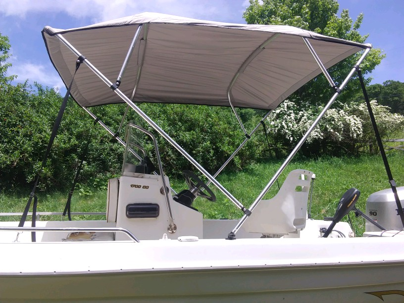
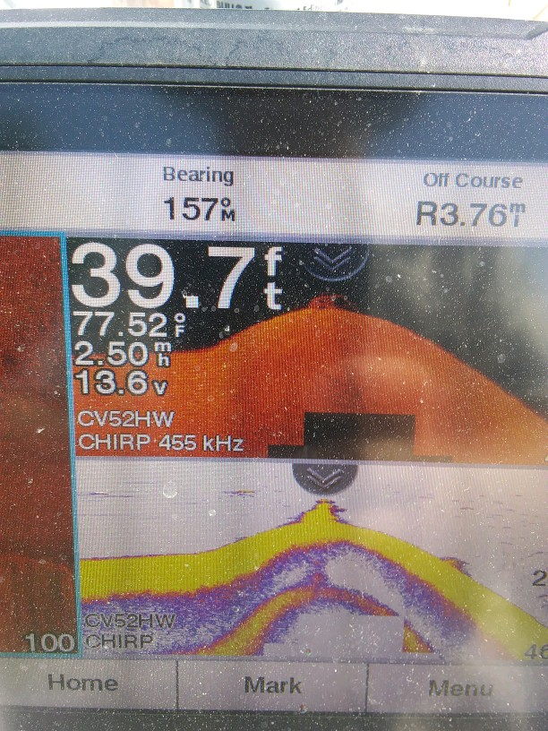

# Why Bust Out Another Thousand (B.O.A.T.)?

Use your mind, prevent a catastrophe. Don't spend the extra grand. Or pray a lot and hope for the best. If you like the water, just keep in mind it don't mix well with metal. No amount of grease maintenance scheduling will beat it. In the end water wins. Know the signs of age and make the preventative maintenance to save the "G" for something else- like the parts to build you an underwater rover with... well that may be a credit card purchase for us blue collar folks with that luxury, but who's counting here- we're talking white collar sports. 

We have a couple trailers, a couple engines (One 1978 2 stroke 200 Series Mercury, One BF90A Honda 4-stroke) a couple fiberglass boats, and not so cheap gear to catch a monster with here. Oh- and a bimini top to sew, but don't tell any of your "poor" friends we know how to sew (or know how to fix broken sewing machines) or you will have 50 pairs of pants, three machines and only one works, sitting next to your bed in a week- I promise you that.

## Tools:
* One good brain
* A few bad mishaps- hopefully not swimming like Sean did.
* Backlog to write your thoughts in and a "schedule" to abide by.

## We will let the pictures speak for themselves

Keeping the blue collar part in the front of the topic here. Let's start with not being on the lake. We have to get the boat there *first*- in one piece. So good transportation here starts with the *driver*, the *vehicle* and *trailer*, and last *the boat*. Just remember we can't fix *stupid*, and I have been oooooohhhhh sooooo close soooo many times. Thanks be to God for not spilling the beans on us, man.

## Trailer "issues"

Clean all the debris from the broken bearing. Don't forget to pack your new bearings.

It's about time to replace this axle with a larger heavier rated one for a 2000lb boat. 

Hub assemblies may come with prepacked bearings and a race preseated. I think we ended up getting ours from the auto part store for 50 bucks a piece after packing a few by hand and learning how tight is too tight on a castle nut. Too loose also can show symptoms of the trailer tires wearing like walking the dog, where the tires are not running completely parallel with the vehicle.

Broken Keel mount measurement. If it ain't broke don't fix it. But I say if you can get the mount and roller cheaper than just the roller from the manufacturer, why not?

Split in two will yield fiberglass grind with a little too fast approach speed.

No more black smudges on the boat. Cool.

## Engines
I have a lot of pics on other machines I need to aggregate for the Mercury. I will be going through the Honda repair log for more things to post here soon. There are a few notables though
* Mercury rebuild lower unit
  * roller bearings exploded (that only needs to happen once to better plan that maintenance routine)
  * prop shaft bearing mount in aluminum housing had to be welded shut and resanded to accept the forward bearing - needle blow out behind bearing from roller. It shook itself senseless.
    * need a new forward bearing. It is not run over trolling speed for the time being if at all.
  * only had to reseat and adjust shim plates once to get the cog to shift smooth between forward and reverse. Not bad for a rookie.
  * Double seals on the prop shaft wore a double groove into it over 40 years. Need to mic and get custom seals with larger inner diameter rubber or get a new $350 shaft. 
  * Keeping an eye on lower unit gear oil has damaged fill screw. Need to tap a larger diameter fill screw. Redneck 101 is teflon tape and homemade spacers. Not good I know, but that will be addressed this fall. 

Honda Prop bushing

Bimini on. There are a lot more pictures for the dismantle. Cam and I marked each section with a sharpie to address the corners by number for the pieces that connected, and in what direction they faced. Each top is made to fit its metal base individually. Then we started dissecting it with a seam ripper, pinned the new pieces to fabric from Jimmy at Tsuga fabric, and used a healthy amount of belding tape off a roll he donated for the cause. 

1/3 Sewn. Notice the pucker. Thats another rookie move. Drink you prune juice and let the pros do it- I mean its a great learning experience to have to roll up bolts of fabric to run through a home machine not meant for industrial application. We only skipped the timing on the first machine once. Thanks to a kind Jamaican from Pittsburg that repaired vacuum cleaners on the side, we were back in business after experimenting first with my sons from scratch Panda costume:)

Fabric density is the key takeaway here. The Panda had a thick wool like poly which needed a thicker needle like a leather punch to make it though. Little did we know that small pieces were pulling off and wrapping around the bobbin housing, inevitably breaking the bobbin and forcing the needle to hit the side of it and making it skip timing. What a mess of knots you will find on the back of that seam when it happens. That's why its good to have an experiment before the real thing.

2/3 of the way and it looks like we may have eaten a few lemons...

Done. And again I broke the bobbin on the last 3 feet of stitching. Plastic 90's model. I took it to my friend that had a 60's all steel version and we blew right through it. The funny thing was, she was a seamstress and never worked with big pieces of fabric- my rookie lines were straighter than hers. Go figure. Point is watch the pucker factor. The trick here is to realize the fabric makes a turn around the edges of the fabric and is not a square fit to the frame, but rather a rounded one. You have to sew it on a flat plane and feed the fabric in such a way as to wrap the dog (foot on the machine) in a fluid circular motion, all the while setting the tension based off canvas and thick UV resistant plastic ($10 dollar N word- oh yeah Nylon:) thread. 

Another great tool is the double sided tape to stick the two pieces together before making the seam. Also, the last big key takeaway is the full felled seam. When you have to make a seam that is exposed on both sides you need to do so in a fashion as to not allow the cut edge exposed to flapping in the wind and unraveling. Thats tricky. My mom shot me a video worth checking out on the 3 main types used for sail boat sails. Parachutes are the next big item to tackle here for both seams and the pucker factor. Good luck with that. My bimini handles 25 knots well and is still holding. That's enough for me.

## Gear

Sometimes the best "bust out another thousand" is for the gear to go fishing with. I like the way new technology looks for fish today. It has side imaging that allows for perpendicular views up to 200 ft from the boat, but sadly enough it does in fact cost a grand amount- but is is worth it. The key to landing the big one here is to follow the bait. Behind every good fisherman is a stinky baitwell too...

