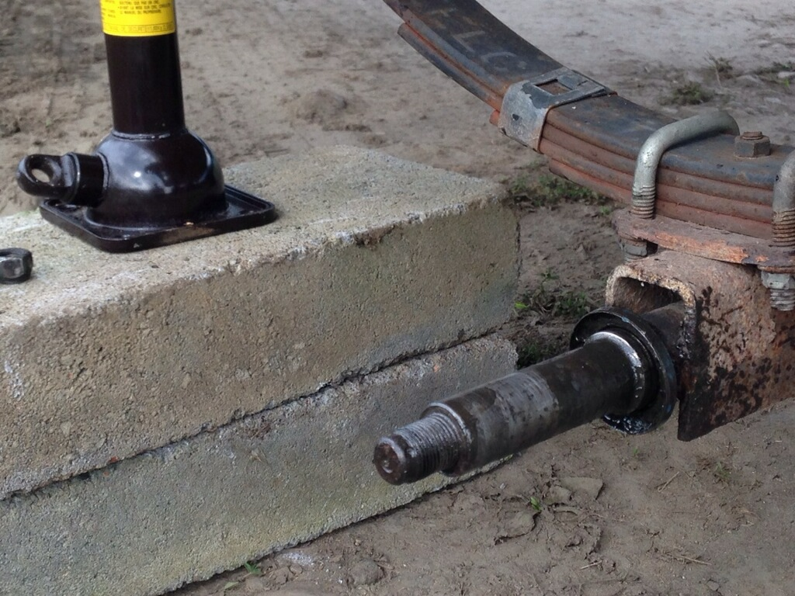
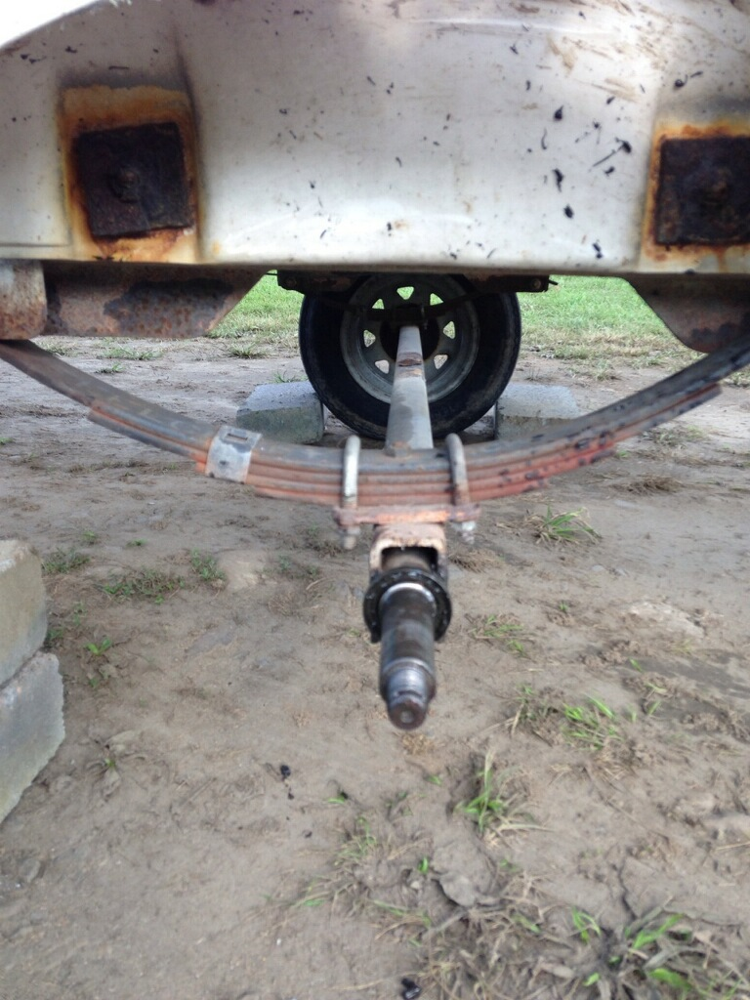
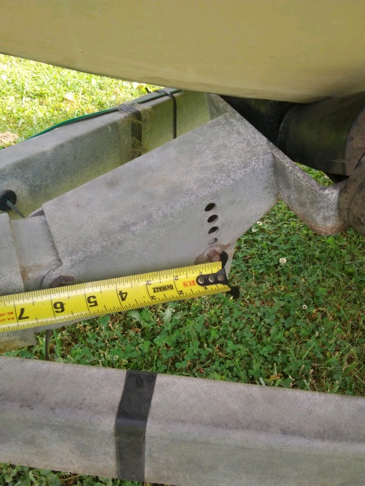
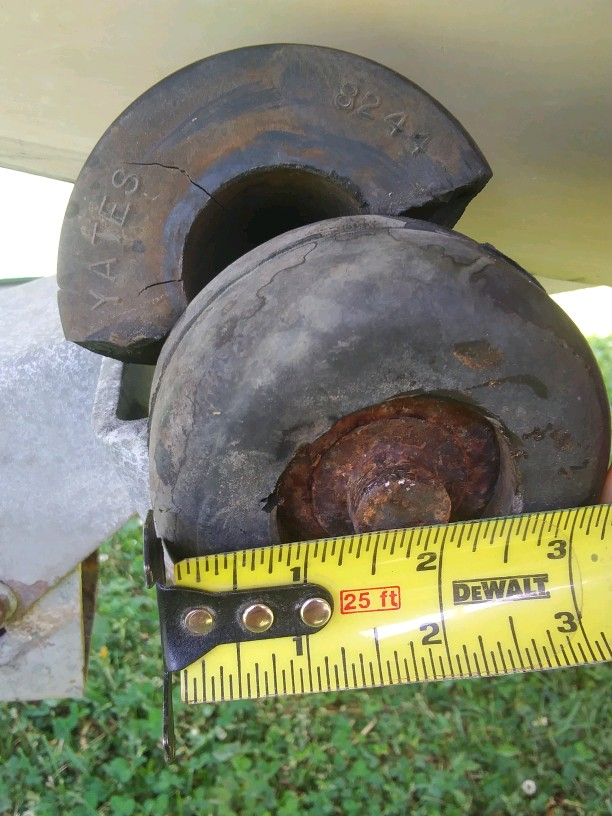
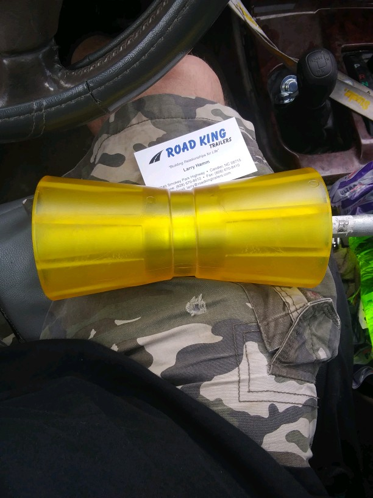
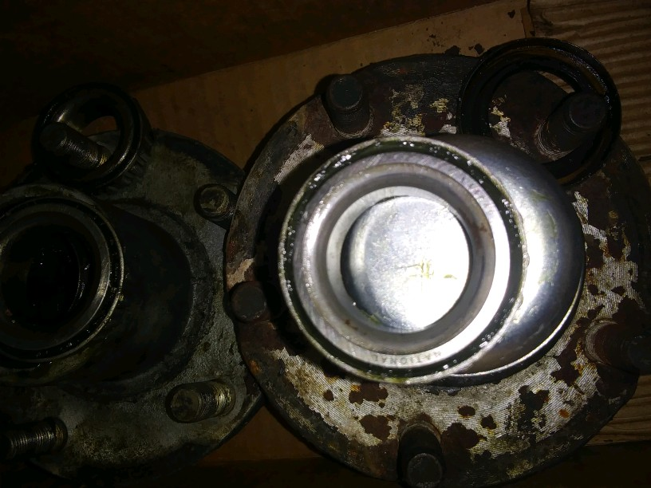
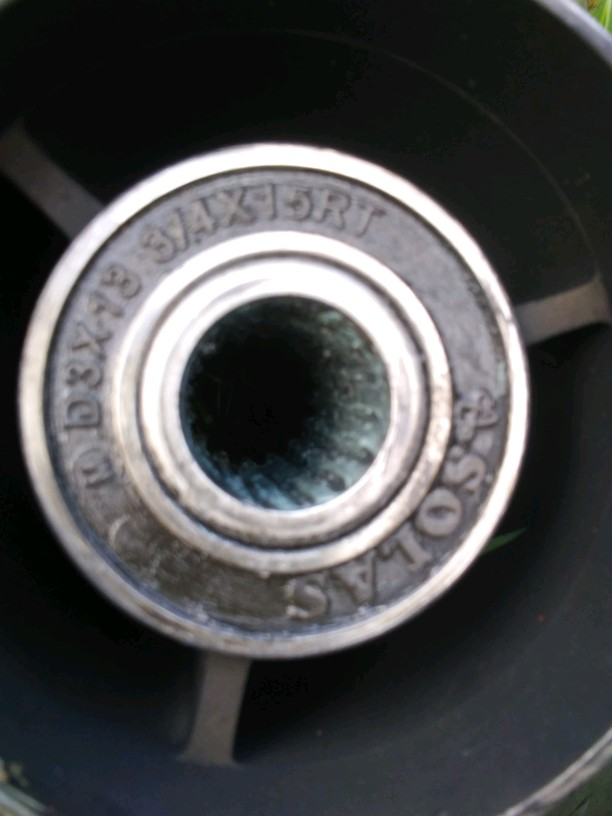
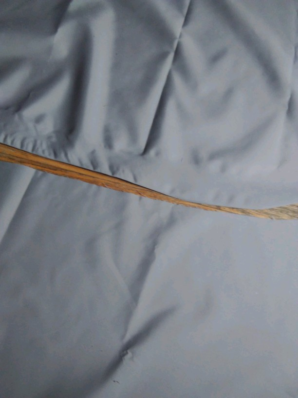
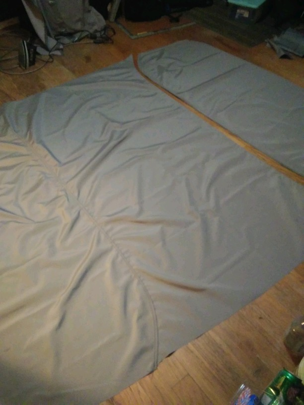
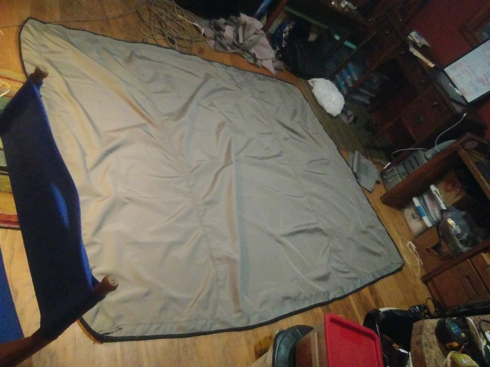

# Why Bust Out Another Thousand (B.O.A.T.)?

Use your mind, prevent a catastrophe. Don't spend the extra grand. Or pray a lot and hope for the best. If you like the water, just keep in mind it don't mix well with metal. No amount of grease maintenance scheduling will beat it. In the end water wins. Know the signs of age and make the preventative maintenance to save the "G" for something else- like the parts to build you an underwater rover with... well that may be a credit card purchase for us blue collar folks with that luxury, but who's counting here- we're talking white collar sports. 

We have a couple trailers, a couple engines (One 2 stroke 200 Series Mercury, One BF90A Honda 4-stroke) a couple fiberglass boats, and not so cheap gear to catch a monster with here. Oh- and a bimini top to sew, but don't tell any of your "poor" friends we know how to sew (or know how to fix broken sewing machines) or you will have 50 pairs of pants, three machines and only one works, sitting next to your bed in a week- I promise you that.

## Tools:
* One good brain
* A few bad mishaps- hopefully not swimming like Sean did.
* Backlog to write your thoughts in and a "schedule" to abide by.

## We will let the pictures speak for themselves

Keeping the blue collar part in the front of the topic here. Let's start with not being on the lake. We have to get the boat there *first*- in one piece. So good transportation here starts with the *driver*, the *vehicle* and *trailer*, and last *the boat*. Just remember we can't fix *stupid*, and I have been oooooohhhhh sooooo close soooo many times. Thanks be to God for not spilling the beans on us, man.

## Trailer "issues"

Broken Keel mount measurement. If it ain't broke don't fix it. But I say if you can get the mount and roller cheaper than just the roller from the manufacturer, why not?

Split in two will yield fiberglass grind with a little too fast approach speed.

No more black smudges on the boat. Cool.

## Engines
I have a lot of pics on other machines I need to aggregate for the Mercury. I will be going through the Honda repair log for more things to post here soon. There are a few notables though
* Mercury rebuild lower unit
  * roller bearings exploded (that only needs to happen once to better plan that maintenance routine)
  * prop shaft bearing mount in aluminum housing had to be welded shut and resanded to accept the forward bearing - needle blow out behind bearing from roller. It shook itself senseless.
    * need a new forward bearing. It is not run over trolling speed for the time being if at all.
  * only had to reseat and adjust shim plates once to get the cog to shift smooth between forward and reverse. Not bad for a rookie.
  * Double seals on the prop shaft wore a double groove into it over 40 years. Need to mic and get custom seals with larger inner diameter rubber or get a new $350 shaft. 
  * Keeping an eye on lower unit gear oil has damaged fill screw. Need to tap a larger diameter fill screw. Redneck 101 is teflon tape and homemade spacers. Not good I know, but that will be addressed this fall. 

Hub assemblies

Honda Prop bushing

Bimini on. There are a lot more pictures for the dismantle. Cam and I marked each section with a sharpie to address the corners, by number for the pieces that connected, and in what direction. Then started dissecting it with a seam ripper, 

1/3 Sewn.

2/3

Done.

